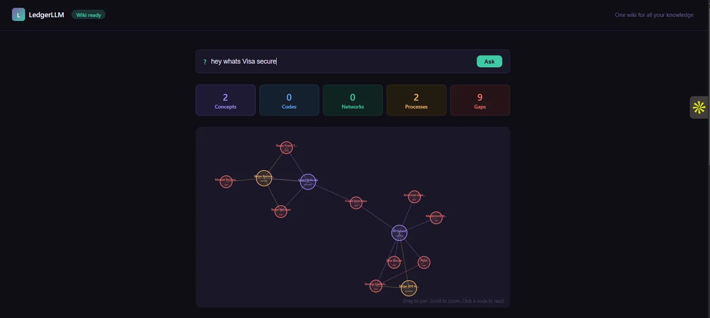
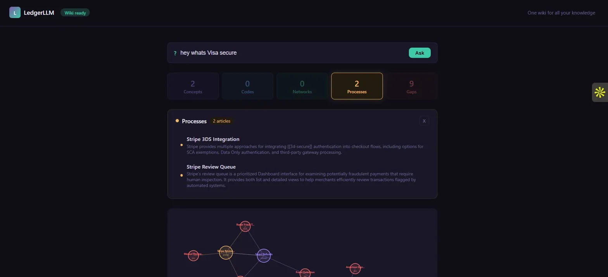
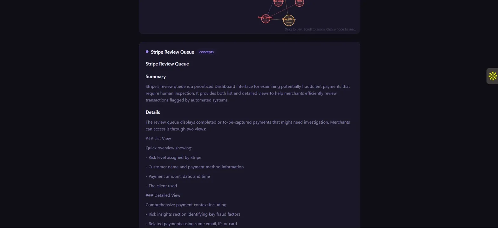
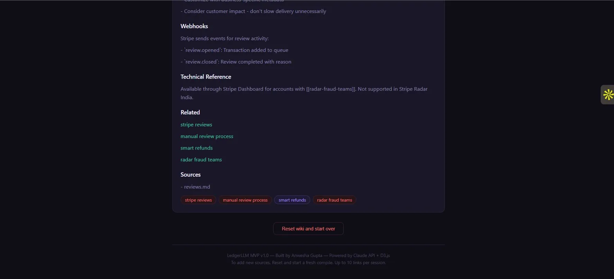
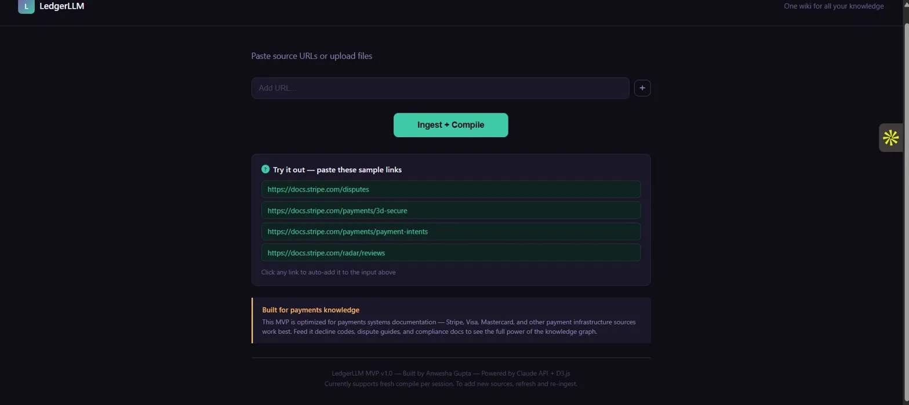
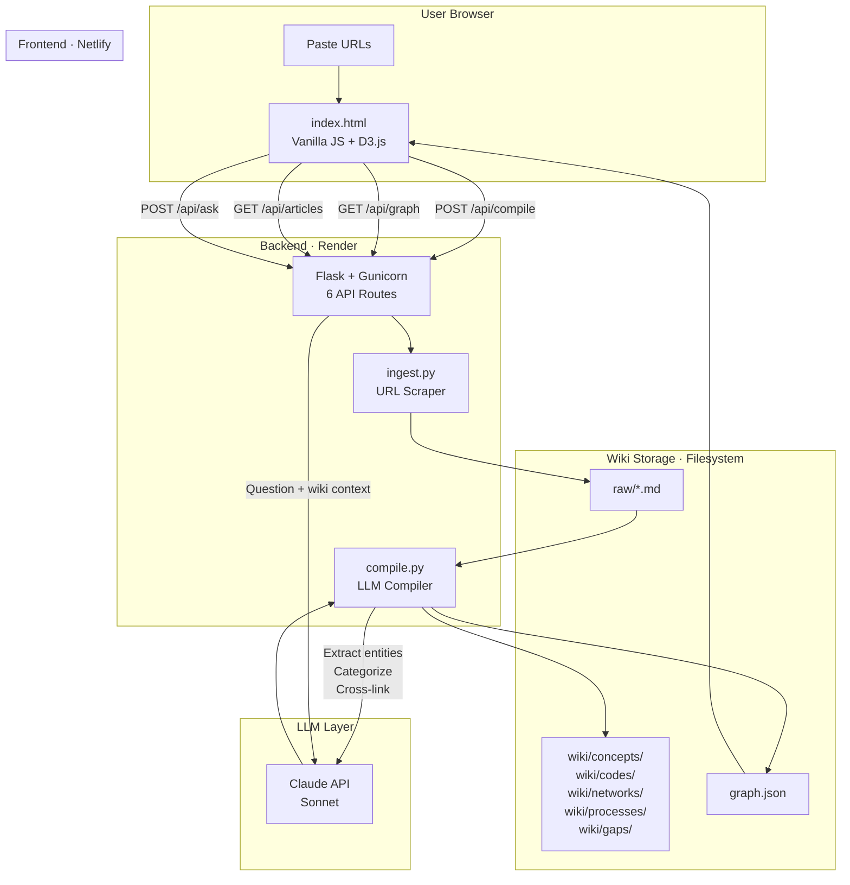

# LedgerLLM

**An LLM-powered knowledge base that compiles raw documents into a structured, interlinked wiki with an interactive knowledge graph.**

Inspired by [Andrej Karpathy's LLM Knowledge Bases](https://gist.github.com/karpathy/442a6bf555914893e9891c11519de94f) pattern. Not a RAG chatbot. Not a static wiki. A compilation engine that reads your documents, extracts entities, builds cross-references, detects gaps, and gives you a visual map of everything your team knows and everything it doesn't.

**[Live Demo](https://gentle-kelpie-f2b165.netlify.app/)** · **[Backend API](https://ledgerllm-payments-wiki.onrender.com/api/graph)**

## Screenshots

### Dashboard with interactive knowledge graph


### Category tiles with article list


### Article viewer with structured content


### Cross-linked tags and related articles


### Input screen with sample links


## Why this exists

Series A through C companies manage critical domain knowledge across Google Drive, Notion, Confluence, Slack, and email. A Visa mandate lives in one doc. Stripe decline codes in another. The compliance process in someone's head. Nothing connects to anything.

When a new hire joins, onboarding takes weeks. When a regulation changes, three teams update three different docs or none of them do. When a PM asks "what are our dispute obligations across Visa and Mastercard," nobody has the answer without a four-hour scavenger hunt.

## LedgerLLM vs everything else

| Capability | Confluence / Notion | RAG Chatbots | Obsidian | LedgerLLM |
|---|---|---|---|---|
| Who writes the articles | Humans (manual) | Nobody (no articles) | Humans (manual) | LLM compiles automatically |
| Knowledge compounds over time | No | No (stateless per query) | Yes (manual links) | Yes (auto cross-links) |
| Visual knowledge graph | No | No | Yes (desktop only) | Yes (web, interactive, color-coded) |
| Gap detection | No | No | No | Yes (red nodes show blind spots) |
| Domain-aware categorization | Manual tags | N/A | Manual tags | LLM categorizes at compile time |
| Ask questions in plain English | No | Yes (but no compiled context) | No | Yes (wiki-grounded, cited answers) |
| Deployment | SaaS (paid) | Custom infra | Desktop app | Netlify + Render (free tier) |

## How it works

```
raw URLs → ingest.py (scrape + clean) → raw/*.md
raw/*.md → compile.py (Claude API) → wiki articles + graph.json
graph.json → D3.js force-directed graph → interactive dashboard
question → /api/ask → Claude reads wiki → cited answer
```

### The Karpathy pattern, productized

1. **Ingest** Paste up to 10 URLs. `ingest.py` scrapes each page, strips navigation and boilerplate, converts to clean markdown with frontmatter metadata.

2. **Compile** `compile.py` sends each raw document to Claude API with a domain-aware system prompt. Claude extracts entities, categorizes articles (concept / code / network / process / gap), generates cross-links as `[[wikilinks]]`, and outputs structured markdown.

3. **Link** The compiler generates `graph.json` with nodes (articles) and edges (cross-references). Edge types include `related`, `part_of`, `requires`, `triggers`, and `prevents`. A post-compilation cleanup identifies ghost nodes and creates gap placeholders.

4. **Visualize** D3.js force-directed graph renders every node and edge. Color-coded by category: purple (concepts), blue (codes), emerald (networks), gold (processes), red (gaps). Click any node to read its article. Drag to reposition. Scroll to zoom.

5. **Query** "Ask the wiki" sends your question plus the full wiki context to Claude API. Answers cite specific articles with clickable links that jump to the referenced node in the graph.

## Architecture



### API Routes

| Route | Method | Purpose |
|---|---|---|
| `/api/graph` | GET | Full knowledge graph (nodes + edges) |
| `/api/articles` | GET | All articles grouped by category |
| `/api/wiki/<id>` | GET | Single article markdown content |
| `/api/compile` | POST | Accepts URLs, runs ingest + compile pipeline |
| `/api/ask` | POST | Question + wiki context to Claude, returns cited answer |
| `/api/reset` | POST | Wipes all data, returns to clean state |

### File structure

```
Ledger/
├── app.py                    # Flask backend (6 routes)
├── requirements.txt          # Python dependencies
├── Procfile                  # Gunicorn start command for Render
├── Claude.md                 # Domain schema for compilation prompts
├── scripts/
│   ├── ingest.py             # URL scraper → raw markdown
│   └── compile.py            # Claude API compilation pipeline
├── raw/                      # Immutable scraped source documents
├── wiki/
│   ├── concepts/             # General knowledge articles
│   ├── codes/                # Error codes, decline codes, status codes
│   ├── networks/             # Platform-specific documentation
│   ├── processes/            # Workflows, procedures, strategies
│   ├── gaps/                 # Referenced but uncovered topics
│   ├── graph.json            # Node + edge data for D3 visualization
│   ├── index.md              # Auto-generated table of contents
│   └── log.md                # Compilation audit trail
└── frontend/
    └── index.html            # Complete frontend (vanilla JS + D3.js)
```

## Three differentiators

### 1. Domain-aware categorization
Every open-source LLM wiki implementation is generic. LedgerLLM's compilation prompt includes strict categorization rules. The `Claude.md` schema defines domain conventions so the LLM knows that "3DS" and "3-D Secure" are the same concept, and that a Visa bulletin should cross-reference Mastercard's equivalent rule.

### 2. Interactive knowledge graph
Nobody has built a web-hosted, interactive, color-coded knowledge graph where a payments ops manager can visually see "this Visa mandate connects to these 4 internal processes." Gap nodes glow red. Click any node to read its article. Drag to rearrange. Zoom to explore.

### 3. Gap detection
Every documentation tool shows you what exists. LedgerLLM shows you what's missing. When Claude compiles articles, it identifies cross-references to topics that have no article. These appear as red gap nodes in the graph. No manual audit required.

## Core challenges solved

| Challenge | How LedgerLLM handles it |
|---|---|
| Entity deduplication ("3DS" vs "3-D Secure" vs "3D Secure 2") | Domain schema with alias resolution rules in Claude.md |
| Cross-source conflicts (two docs disagree on retry logic) | Confidence levels in frontmatter: high, medium, low, none |
| Manual categorization (nobody tags their docs) | LLM applies strict rules at compile time: workflows → process, error codes → code |
| Orphan references (edges pointing to nonexistent articles) | Post-compilation cleanup reclassifies orphans as gaps with placeholder .md files |
| Knowledge decay (stale docs nobody updates) | Gap nodes surface when new sources reference outdated or missing articles |

## Use cases by company stage

| Stage | Team size | Core pain | How LedgerLLM helps |
|---|---|---|---|
| Series A | 5-15 people | Knowledge lives in 2-3 people's heads. New hire onboarding takes weeks. | Compile 10 key docs into searchable wiki. Onboarding drops from 2 weeks to 2 days. |
| Series B | 30-80 people | Multiple squads, nobody knows which docs are current. Visa updates quarterly, Stripe changes APIs. | Gap detection catches stale docs. Single source of truth across payments ops, compliance, and engineering. |
| Series C | 100-300 people | Multi-geography teams handling different card networks, regulations, and processors. | Institutional brain across regions. "What are our obligations for a German customer disputing on Mastercard?" answered with citations across 50+ articles. |

## Tech stack

| Layer | Technology | Why this choice |
|---|---|---|
| Frontend | Vanilla JS + D3.js | No build step, no Node.js dependency, full control over graph physics |
| Backend | Flask + Gunicorn | Lightweight, Python-native, easy to deploy on free tier |
| LLM | Claude API (Sonnet) | Best structured output quality for entity extraction and categorization |
| Ingestion | BeautifulSoup + Requests | Reliable scraping, handles most documentation sites |
| Hosting | Render + Netlify | Free tier, auto-deploy from GitHub, zero DevOps |
| Storage | Filesystem (markdown + JSON) | No database overhead, git-trackable, human-readable |

## Run locally

```bash
git clone https://github.com/ANWESHAGUPTA/LedgerLLM-payments-wiki.git
cd LedgerLLM-payments-wiki

pip install -r requirements.txt
set ANTHROPIC_API_KEY=your-key-here
python app.py
```

Open `frontend/index.html` in your browser. Paste URLs, hit compile, explore the graph.

## What's next

| Feature | Description | Impact |
|---|---|---|
| Chrome extension | "Save to Ledger" button that queues URLs from any page | Frictionless ingestion while browsing |
| Knowledge score | Completeness percentage that gamifies gap-filling | Retention through progress tracking |
| Graph focus mode | Click a node, dim everything except its 2-hop neighborhood | Deeper exploration without visual noise |
| Incremental compilation | Add new sources without recompiling everything | Faster iteration for growing knowledge bases |
| Team accounts | Shared wiki with role-based access | Multi-user collaboration |

## Market context

The global knowledge management software market is valued at $26.4B in 2026, growing at 13.8% CAGR to $74.2B by 2034. BFSI is a top adopting sector. Series A-C fintechs with payments teams of 5-20 people represent a $2.5-3B serviceable market currently served by horizontal tools with no domain intelligence, no visual graph layer, and no gap detection.

Built by [Anwesha Gupta](https://anweshagupta.com) · Powered by Claude API · Inspired by Karpathy's LLM Knowledge Bases
